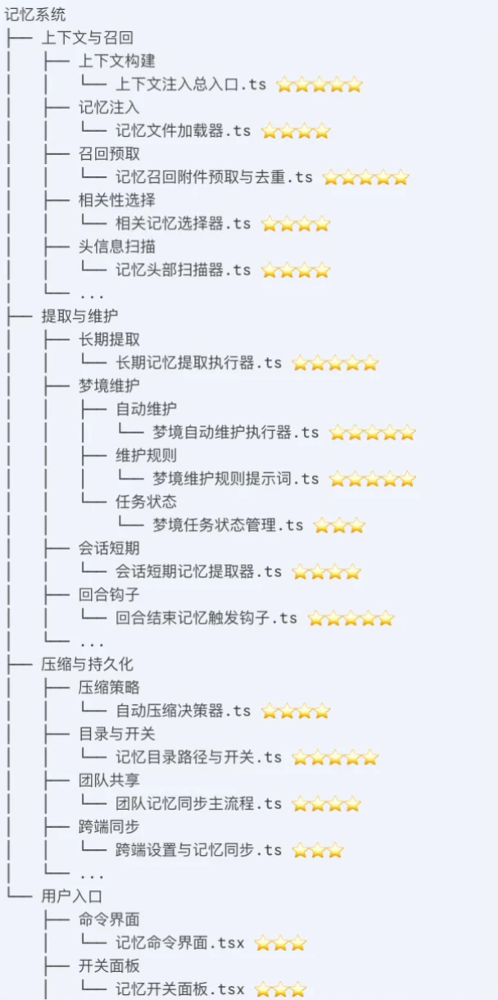
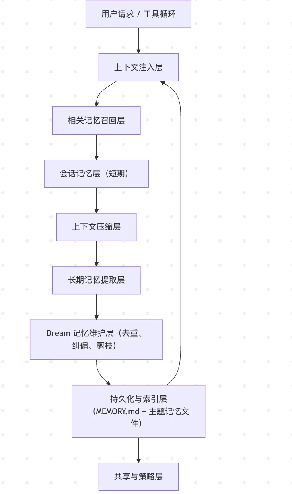

# Claude Code 泄漏版：智能体长期记忆与自我进化解析

> 不是单 agent 变聪明，而是把 agent 做成了一套可调度、可持久化的 runtime

<!-- more -->

这几天各种指南分析满天飞，个人建议感兴趣但又不想花时间研究的同学再等等。目前好多分析非人工生产，不够精华。源版能学的东西太多，按照你感兴趣的方向去分析更有价值。

这里只集中一点：分析泄漏版 Claude Code 对**长期记忆**的处理。

<div class="repo-card-row">
<div class="repo-card">
<a href="https://www.xiaohongshu.com/discovery/item/69d07c12000000001a033ad4" target="_blank" rel="noopener noreferrer">
<div class="xhs-note-card">
  <div class="xhs-note-header">
    <span class="xhs-badge">
      <svg class="xhs-badge-icon" viewBox="0 0 18 18" xmlns="http://www.w3.org/2000/svg"><rect width="18" height="18" rx="4" fill="#FF2442"/><text x="50%" y="55%" dominant-baseline="middle" text-anchor="middle" font-family="'PingFang SC','Microsoft YaHei',sans-serif" font-size="7" font-weight="bold" fill="white">书</text></svg>
      小红书
    </span>
    <span class="xhs-note-title">claude code源码解析：记忆系统和自我进化</span>
  </div>
  <p class="xhs-note-desc">Claude Code 的自动化不是单 agent 自己变聪明，而是把 agent 变成一个可以被调度、分工、后台运行的运行系统。</p>
  <div class="xhs-note-stats">
    <span class="xhs-stat">
      <svg viewBox="0 0 24 24" fill="currentColor" xmlns="http://www.w3.org/2000/svg"><path d="M12 21.35l-1.45-1.32C5.4 15.36 2 12.28 2 8.5 2 5.42 4.42 3 7.5 3c1.74 0 3.41.81 4.5 2.09C13.09 3.81 14.76 3 16.5 3 19.58 3 22 5.42 22 8.5c0 3.78-3.4 6.86-8.55 11.54L12 21.35z"/></svg>
      37
    </span>
    <span class="xhs-stat">
      <svg viewBox="0 0 24 24" fill="none" stroke="currentColor" stroke-width="2" xmlns="http://www.w3.org/2000/svg"><path d="M5 5a2 2 0 0 1 2-2h10a2 2 0 0 1 2 2v16l-7-3.5L5 21V5z"/></svg>
      —
    </span>
  </div>
</div>
</a>
</div>
</div>

---



## 一、Agent 自动化：受控 runtime，而非单次工具调用

Claude Code 泄漏版已经明显在往 `planner → workers → tasks → scheduler → remote control → policy gate` 这套 runtime 走。它的强不在某个单独功能，而在于：工具循环、任务系统、调度触发、远程会话、权限控制、记忆提取、上下文压缩、持久化目录、团队同步这些层已经被放进同一个壳里了。

明确有：

- 多 agent 编排层
- 任务层
- 状态层
- 远程 / 后台层
- 技能与插件层
- IDE / 外部控制桥接层

**工具层泄漏结构直接列出了这些工具：**

| 工具 | 职责 |
|------|------|
| `AgentTool` | 拉起子 agent |
| `SendMessageTool` | agent 间发消息 |
| `TeamCreateTool / TeamDeleteTool` | 团队型 agent 组织 |
| `TaskCreateTool / TaskUpdateTool` | 任务生命周期 |
| `EnterPlanModeTool / ExitPlanModeTool` | 先计划再执行 |
| `EnterWorktreeTool / ExitWorktreeTool` | 隔离工作区 |
| `SleepTool` | 主动模式等待 |
| `CronCreateTool` | 定时触发 |
| `RemoteTriggerTool` | 远程触发 |
| `SyntheticOutputTool` | 结构化输出 |

**命令层**暴露了 `/tasks`、`/memory`、`/resume`、`/desktop`、`/mobile`、`/compact`、`/mcp`，说明 CC 已经把"任务、恢复、跨端接力、上下文压缩、工具网络"都放在一线命令里，而不是内部隐藏能力。

泄漏摘要里点名的特性标志：

- `KAIROS`：长期运行 assistant
- `PROACTIVE`：主动执行任务，配合 SleepTool
- `COORDINATOR_MODE`：多 agent 编排
- `BG_SESSIONS`：后台会话
- `KAIROS_GITHUB_WEBHOOKS`：PR / webhook 事件推送
- `BRIDGE_MODE + DAEMON`：远程控制、常驻后台

## 二、长期记忆：系统化分层处理

Claude Code 泄漏版里，长期记忆不是单一模块，而是一条完整链：

- `context.ts`：先收集当前系统 / 用户上下文
- `compact/`：会话太长时压缩上下文
- `extractMemories/`：从交互里自动提取可沉淀记忆
- `memdir/`：持久 memory 目录
- `teamMemorySync/`：团队记忆同步
- `remoteManagedSettings/`：远程托管设置
- `/memory` 命令：用户可见的记忆入口

它的长期记忆处理分成四层：

**① 会话内记忆**：当前回合和近程上下文，偏短时工作记忆。

**② 压缩记忆**：长会话里做摘要和浓缩，控制 token 成本，同时保留关键状态。

**③ 提取型长期记忆**：不只是保存 transcript，而是从交互中抽取，把会话内容蒸馏成可长期复用的结构化记忆。

**④ 持久化与共享记忆**：`memdir/` 说明长期记忆有实际落地位置；`teamMemorySync/` 则说明记忆准备向团队共享演进。



完整管线：

```
会话发生 → 提取值得沉淀的内容 → 写入 memdir / 设置层
         → 下次 context 构建时重新注入
         → 长会话时由 compact 裁剪和浓缩
         → 必要时 team sync 扩展到多人共享
```

## 三、Dream System：自维护，而不是越存越乱

Dream system 的核心不是"Claude 终于记住你了"，而是：

> 旧方案会堆重复记忆、记忆会过时、index 会膨胀——新方案要主动维护记忆的生命周期。

维护流程：`survey → gathering → consolidation → prune`

- merge duplicates（合并重复）
- remove stale facts（清除过时信息）
- 让每个 session 的 context 更干净

这点非常重要，说明 Anthropic 对长期记忆的理解不是简单"多存点"，而是：**memory needs lifecycle management**——记忆要被抽取、去重、更新、裁剪、同步，不是无限累计。

这和做 TrendR / research agent 特别相关。你真正需要的不是"永远保存所有研究对话"，而是：

- 哪些 query 好用
- 哪些 paper 值得优先引用
- 哪些 taxonomy 经常复用
- 哪些验证规则要长期保留
- 哪些项目偏好应该自动注入

## 四、自动化 × 长期记忆 = Agent Runtime

Claude Code 泄漏版最值得学的，不是某个单独工具，而是：**自动化和长期记忆被放进同一个 runtime 里协同工作**。

| 平面 | 职责 |
|------|------|
| task plane | 分工 / 调度 / 后台 / 定时 / 远控 / 恢复 |
| memory plane | 抽取 / 压缩 / 持久化 / 同步 / 注入 |
| tool plane | 各类能力工具 |
| control plane | 权限 / 策略 / 远程管控 |

两者一结合，就不是普通 REPL 了，而是：**一个能持续运行、逐步积累工作上下文的 agent runtime**。
