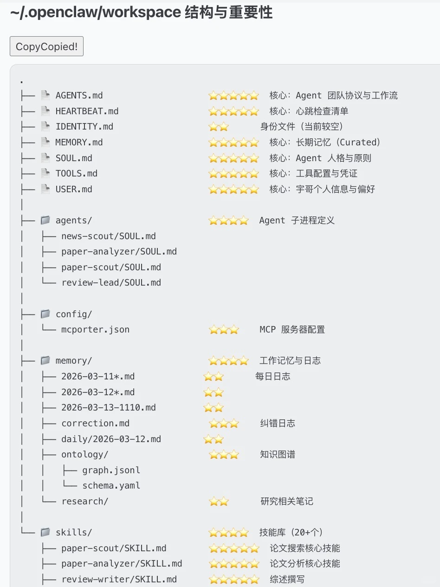

# OpenClaw 新手到高阶全攻略：技能矩阵到手搓工作流

> 从新手到进阶，再到自己手搓工作流——一步一步带你走完

<!-- more -->

适用范围：帮助安装了 OpenClaw 但不知道怎么优化记忆、装技能和 MCP 的用户。

{{ card_row(github_repo("gy-hou/openclaw"), xhs_note("OpenClaw进阶攻略：技能矩阵到手搓工作流", "https://www.xiaohongshu.com/discovery/item/69b503b1000000002102ca8e", 847, 1677, "Lucas｜AI X Fintech")) }}



---

## 最重要的四件事

### 1. 优化记忆结构

先下载 `tree`，把你的工作区目录结构打印出来，发给 Claude 或 GPT，让它帮你梳理记忆结构、目录层级和文件组织方式。

提以下需求：

> 帮我优化记忆结构和层级，标注重要性（5⭐）：哪些内容该长期保留、哪些该拆分、哪些该放进短期 / 长期记忆结构里。

先把记忆结构理顺，后面很多事都会顺。

### 2. 技能矩阵存入长期记忆

让它生成自己的技能矩阵并保存在长期记忆里。当你做 agents 时，可以强制把矩阵写入元数据，确保调用技能。不要只看"装上了没有"，要一个个测试——在 UI 界面里，尽量让所有技能都变成 **eligible**（这一步解决 AI 遗忘机制）。

### 3. 安装 skill-vetter，然后去 ClawHub 按需装技能

对于下载数量少的技能，要么别碰，要么自己审核。先按自己的需求找，一次只装少量。如果下载不了（超 rate），直接 unzip 到本地，让它自己配置。

**推荐技能清单（按领域）：**

| 类别 | 技能 |
|------|------|
| 研究 | `research-vault`、`arxiv-watcher` |
| 搜索 | `tavily-search`、`deepresearchwork`、`summarize` |
| 浏览器 | `agent-browser`、`playwright-mcp` |
| 金融 | `yahoo-finance` |
| 媒体 | `youtube-watcher` |
| 工具 | `g0g`、`mcporter`、`nano-pdf` |
| 安全 | `skill-vetter` |
| 自动化 | `self-improving-agent`、`agent-team-orchestration`、`auto-updater` |
| 内容 | `humanizer`、`agent-directory` |

!!! tip "原则"
    技能不是越多越强——甚至越多越笨。能融进你的工作流才有意义。

### 4. 让它每周定期学习

从 Moltbook、EvoMap 每周固定去学习别的助理的热门帖子、技能和思路，通过 self-learning 把经验导入长期记忆。

---

## 进阶：外接知识库和搜索能力

### 外接 Obsidian 作为长期知识库

当你开始认真用 OpenClaw，你会发现单靠内部记忆已经不够了。这时候可以把 Obsidian 接进来，把它当成一个外置的长期知识库：

- 记忆更清晰，内容容易管理
- 方便后续复用，适合长期积累
- **OpenClaw 负责调用，Obsidian 负责沉淀**

### 网页抓取能力

很多时候，OpenClaw 的问题不是"不会想"，而是"拿不到足够多的信息"。先用 scrapping 补充搜索短板，再利用好阿里的 **Page-Agent** 处理网页任务和页面操作。

### 建立本地索引

当外置记忆库有 200G 以上内容时，用 **QMD MCP** 建立索引：

- 低配：embedding + Gemini 免费 API
- 高配：混合语义搜索的小模型路线（需要 2G+ 内存）

### 技能更新

针对自己的领域，定期从 [awesome-openclaw-skills](https://github.com) 里找适合自己的 skills。OpenClaw 最终一定走向垂直化，而不是全能化。

---

## 插件和 MCP：真正拉开差距的地方

Skill 更像"现成能力"，而 plugins / MCP server 更像"接口层"和"扩展层"。真正把 OpenClaw 拉开差距的，往往不是 skill，而是它接了什么外部能力。

| MCP 工具 | 核心能力 |
|----------|----------|
| Playwright | 浏览器自动化 |
| Firecrawl | 网页转 Markdown |
| Scrapling | 高效网页抓取 |
| Context7 | 深度联网搜索 |
| n8n | 工作流自动化 |
| TrendRadar | 全网趋势监测 |
| Zotero | 学术文献管理 |
| qmd | 数据内容索引 |
| Draw.io | 专业逻辑绘图 |

### 外接 Claude Code / Codex

让最会做流程的去做流程，让最会写代码的去写代码：**OpenClaw 负责调度、记忆和流程，Claude Code / Codex 负责更强的编码与执行**。

---

## 高阶篇：手搓工作流

### 原则：先分析需求，再做逻辑链

到了高阶阶段，需求越特殊，通用技能越不够用。第一步永远不是"先装"，而是先想清楚：

1. 我要解决什么问题
2. 这个问题的逻辑链是什么
3. 哪些环节可以自动化
4. 哪些环节必须自己把关

先有逻辑链，再有工作流。

### 让 Claude 指导你手搓

越特殊的需求，越不要期待"现成插件一键解决"：

1. 先把逻辑链想清楚
2. 再让 Claude 帮你拆流程
3. 再自己一点点手搓出来

### 实例：TrendR 学术工作流

我自己做的学术 skill **TrendR** 的核心逻辑链：

```
搜论文 → 去重/评分 → 精读提取 → 生成综述 → 整理参考文献 → 持久化到知识库 → 后续迭代
```

完整工具栈：

```
OpenClaw（多 agents 处理流程调用）
  + Scrapling MCP（辅助搜索）
  + 9 source（主要搜索）
  + Obsidian（知识沉淀）
  + qmd（混合语义搜索）
  + Zotero（文献管理）
  + Nano-pdf（PDF 处理）
```

这套组合不是堆工具，是按照工作流选择每一步的最优解。

{{ card_row(github_repo("gy-hou/trendr")) }}
